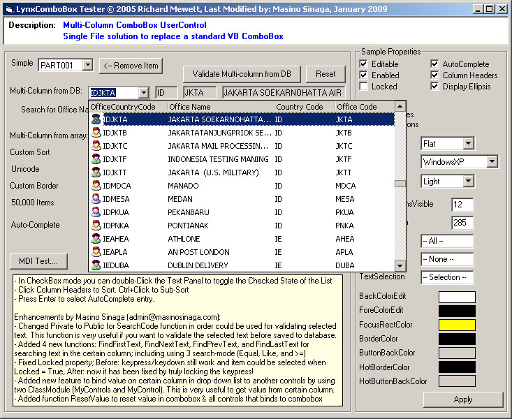



## LynxComboBox v2\.0, The Best Enhancements for Multi\-Column ComboBox

### Description

This source code contains some good enhancements that I made for LynxComboBox v1.30 with multi-column drop-down list feature belongs to Richard Mewett that you can get from: http://www.planet-source-code.com/vb/scripts/ShowCode.asp?txtCodeId=61438&amp;lngWId=1 .

I have made some modifications and new features on LynxComboBox control. I also have separated the project become two projects (one is LynxComboBoxTest.vbp, and the other is LynxDataCombo.vbp) in order easy for you to compile it become an .ocx file (if neccessary). Just open the RunThisForTest.vbg to test those both project at once.

So, let's see what's new that I made so far:

(1)--&gt; Changed Private to Public for SearchCode function in order could be used for validating selected text on LynxComboBox. This function is very useful if you want to validate the selected text before saved that selected item or another certain value from drop-down list to your database.

(2)--&gt; Added 4 new functions: FindFirstText, FindNextText, FindPrevText, and FindLastText for searching text in the certain column. This search feature included using 3 search-mode ("Equal", "Like", and "&gt;="). This is very useful if you want to find a string on certain column in drop-down list and want to know which item(s) contains that string. If the string found, the item would be selected automatically in the LynxComboBox. See at the demo project.

(3)--&gt; Fixed minor-bug on Locked property. Before: KeyPress/KeyDown still work or affected and item could be choosen or selected when Locked = True, After: Now it has been fixed by truly locking when you press the key from your keyboard! I think some of you did not realize this bug, don't you? ;-)

(4)--&gt; Added new feature to bind value on certain column in drop-down list to another controls by using two ClassModule (MyControls.cls and MyControl.cls). Those two classes and the technique I got from Marcelo Luiz Altafin on http://www.planet-source-code.com/vb/scripts/ShowCode.asp?txtCodeId=37751&amp;lngWId=1 then I combine them. I also give him a credit for this new feature. This feature is very useful if you want to get the value from certain column of drop-down list and automatically filled-in to another controls on your form (such as TextBox). So, from now on, you don't have to get a value from ItemText manually anymore. Just bind your TextBox control to the LynxComboBox by using .MyControls property... (see at the demo project) and... tarraaa... the TextBox(es) filled-in automatically. Even this feature still works if you press down-arrow or up-arrow key from keyboard to browse the items in LynxComboBox.

(5)--&gt; Added function ResetValue to reset value in LynxComboBox and all controls that binds to the LynxComboBox (such as TextBox). This is very useful if you make an entry data form, and after user save the record to database, then the selected item in LynxComboBox on your form back to blank and ready to receive new input again (similiar with Reset button function on HTML). This is also affected to the controls that binds to LynxComboBox (such as TextBox), the value become blank string.

I also added a database for test purpose if you want to get the items from your database. I added one form with a progressbar in order to let user know about the progress while retrieving records from database. This is recommended if you get so many records from your database and load them to your LynxComboBox.

I changed the version become 2.0.0. To Richard Mewett, I hope you don't mind about this new version, right? :-) The copyright of this user control is still belongs to Richard Mewett and his name is still written on the code because he deserve. Download it and proof it now. Any comments and votes would be truly appreciated. Thank you and have a nice code, everyone. Tag: Multi-Column, multi column drop-down list, drop down list.
 
### More Info
 

             |
---                |---
**Submitted On**   |2009-01-07 09:26:38
**By**             |[Masino Sinaga](https://github.com/Planet-Source-Code/PSCIndex/blob/master/ByAuthor/masino-sinaga.md)
**Level**          |Intermediate
**User Rating**    |5.0 (135 globes from 27 users)
**Compatibility**  |VB 6\.0
**Category**       |[Custom Controls/ Forms/  Menus](https://github.com/Planet-Source-Code/PSCIndex/blob/master/ByCategory/custom-controls-forms-menus__1-4.md)
**World**          |[Visual Basic](https://github.com/Planet-Source-Code/PSCIndex/blob/master/ByWorld/visual-basic.md)
**Archive File**   |[LynxComboB213985182009\.zip](https://github.com/Planet-Source-Code/masino-sinaga-lynxcombobox-v2-0-the-best-enhancements-for-multi-column-combobox__1-71617/archive/master.zip)

